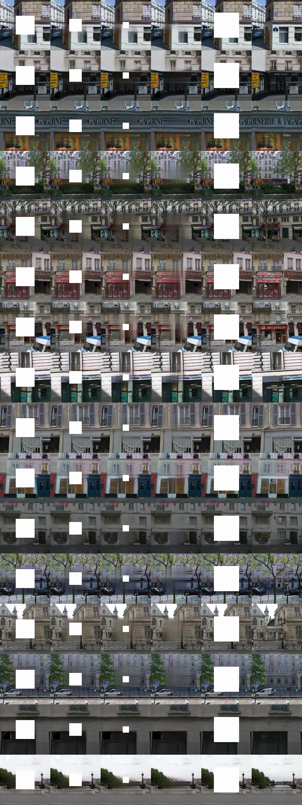
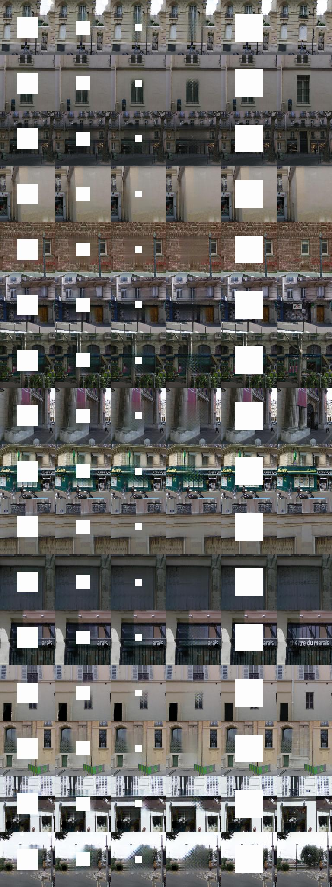
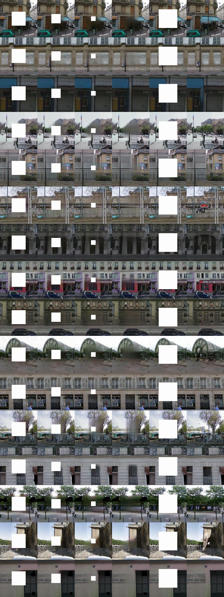
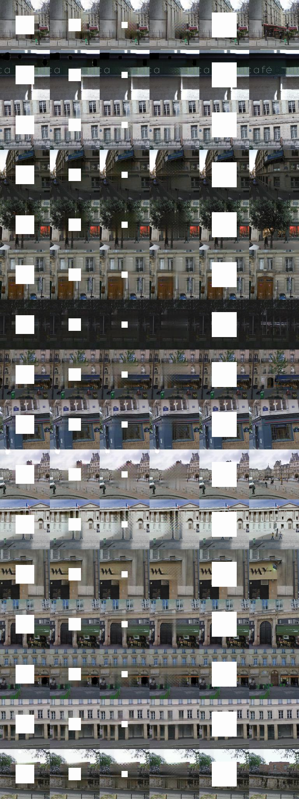
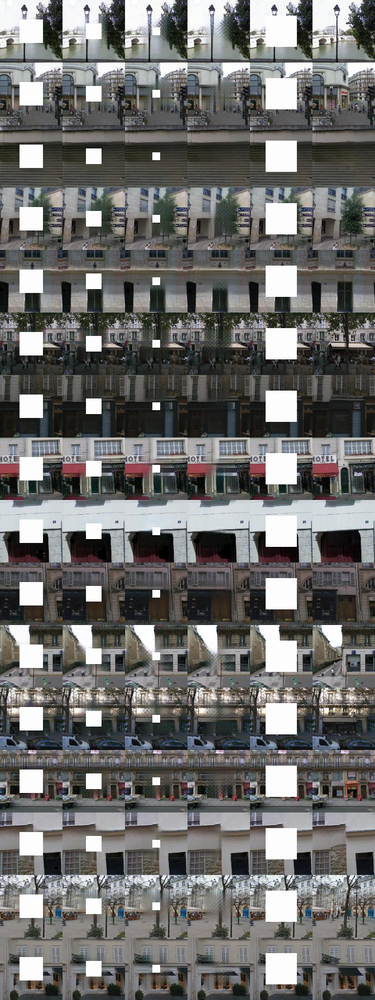
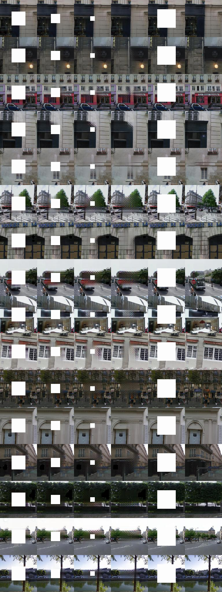
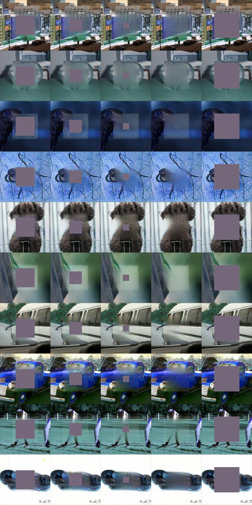

# Progressive-Generative-Networks
Semantic Image Inpainting with Progressive Generative Networks

# Prerequisites

Python, NumPy, SciPy, Matplotlib
A recent NVIDIA GPU

**A latest master version of Pytorch**

# Progress
The code will be released after the paper is published.

# Results

